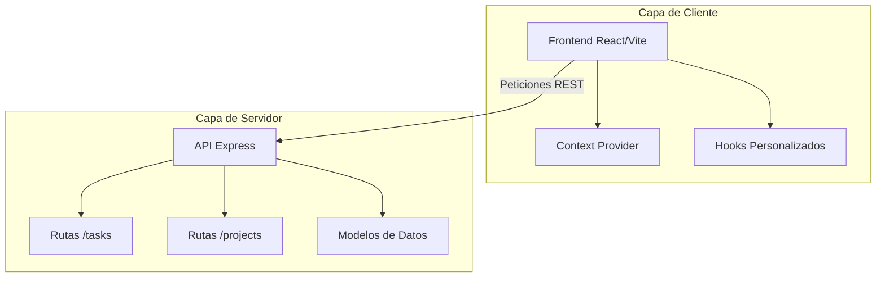

# TaskFlow Pro - Gestión de Tareas Profesional

<div align="center">


[](https://juliaht15-taskflow-project.vercel.app)
[](https://opensource.org/licenses/MIT)

</div>

## 📖 Introducción y Demo

**TaskFlow Pro** es una plataforma Fullstack diseñada para la organización eficiente de tareas y proyectos. El objetivo principal es ofrecer una experiencia de usuario fluida (SaaS-style) con un rendimiento óptimo, permitiendo a los usuarios gestionar su carga de trabajo diaria con una interfaz moderna y profesional.

- 🌐 **Live Demo:** [https://juliaht15-taskflow-project.vercel.app](https://juliaht15-taskflow-project.vercel.app)
- 📌 **Gestión Ágil:** [Ver Tablero Kanban en Trello](https://trello.com/b/CFXX99qx/task-flow-phase-5)

---

## ⚙️ Instalación y Configuración

Sigue estos pasos para levantar el entorno de desarrollo localmente:

### 1. Clonar el repositorio

```bash
git clone https://github.com/juliaht15/taskflow-project.git
cd taskflow-project
```

### 2. Configurar el Backend (API)

```bash
cd api
npm install
npm run dev
```

### 3. Configurar el Frontend (React)

```bash
cd ../react
npm install
npm run dev
```

---

## 🚀 Funcionalidades

- **Gestión de Ciclo de Vida:** Creación, edición, completado y eliminación de tareas en tiempo real.
- **Filtro de Búsqueda Inteligente:** Localización instantánea de tareas mediante un buscador dinámico.
- **Categorización por Proyectos:** Organización jerárquica con etiquetas visuales y selección de proyectos.
- **Tematización Dual:** Soporte nativo para Modo Claro y Modo Oscuro con persistencia.
- **Validación de Datos:** Uso de TypeScript en todo el flujo para asegurar la integridad de la información.

---

## 🏗️ Arquitectura y Stack Tecnológico

### Stack Técnico

- **Frontend:** React 18/19, Tailwind CSS, Lucide React, Context API.
- **Backend:** Node.js, Express, TypeScript.
- **Seguridad:** Middlewares de CORS y validación de esquemas.

### Estructura de Comunicación



---

**Autor:** [Julia Huertas](https://github.com/juliaht15)  
_Proyecto Final - Desarrollo Fullstack 2026_
